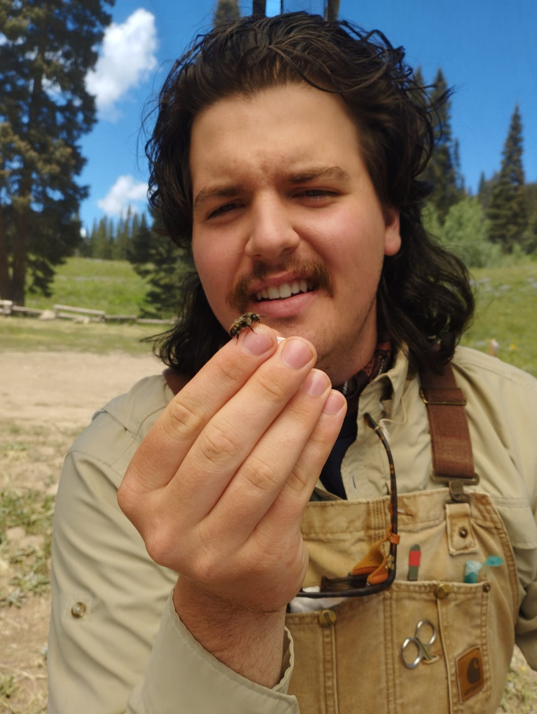
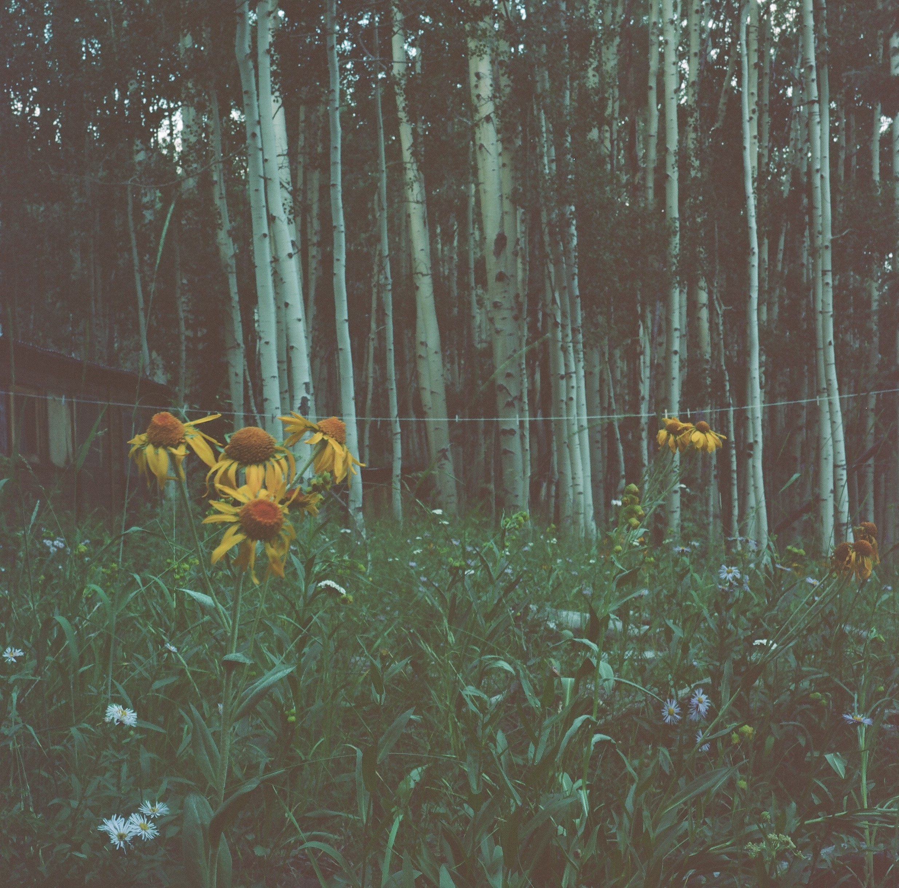
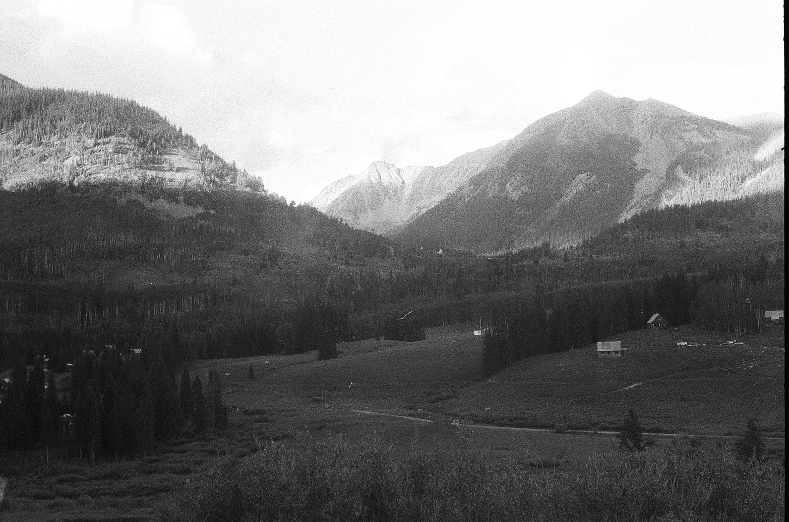
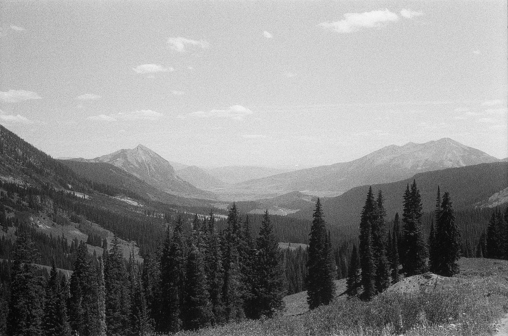
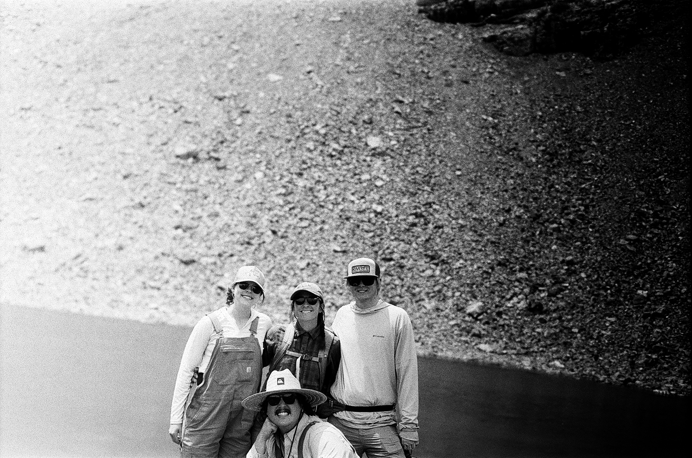

# I am a second year PhD student in the [Department of Ecology and Evolutionary Biology](https://eeb.arizona.edu) at the University of Arizona, advised by [Judith L. Bronstein](https://en.wikipedia.org/wiki/Judith_Bronstein). 
 Bronstein Lab c. 2025. From left to right: lab alumnus Alex Karnish, PhD, lab alumnus Austin Cruz, PhD, Molly Gans, Sav Fuqua (behind tree), Judie Bronstein, PhD, Nick Dabagia, Meredith Willmott.
#### I am interested in the impacts of environmental change on plant-pollinator communities. So far, these have been communities in the Rocky Mountains of Southwestern Colorado, since the [Rocky Mountain Biological Laboratory (RMBL)](https://www.rmbl.org) has been my home away from home in the summers since 2023.
 NJD holding a _Bombus flavifrons_ worker, August 2023 in Gunnison County, CO, USA, taken by D. Souto-Vilaros.
#### I am fundamentally a field ecologist, no doubt because of my childhood spent rambling through the remnant blackland prairies and limestone creeks of North Texas, but also the summer I spent taking courses and doing fieldwork at 'Bug Camp', the [University of Michigan Biological Station](https://lsa.umich.edu/umbs) in Northern Michigan.
 _Hymenoxys hoopsii_, commonly called 'orange sneezeweed', photographed in late July outside Pelton Cabin, Gothic, CO, USA. N. Dabagia, via Rolleicord III on Kodak Portra 400.
#### I am also a passionate cyclist and [UnRacer](https://www.rivbike.com/products/unracer-patch-1?_pos=1&_sid=4a38a3613&_ss=r), and I enjoy playing the banjo and piano, cooking, reading, and pottery at the [Tucson Clay Co-Op](https://www.tucsonclayco-op.com), of which I am an enthustiastic member. Almost all the photos on this site are taken with a manual film camera, no automation, by me, a highly enthusiastic and unskilled photographer. Others are probably begrugingly taken on my iPhone 13.
## Professional Background
#### I studied ecology and evolutionary biology at the University of Michigan, graduating with an honors BS with distinction and a minor in Buddhist studies. My undergraduate research at UM was supervised by [Elizabeth Tibbetts](https://lsa.umich.edu/eeb/people/faculty/tibbetts.html), working on various projects in the lab related to the ecology and cognition of paper wasps. This research culminated in my senior honors thesis "Nest site selection and social group formation in _Polistes_ paper wasps", which received an Honors commendation from my thesis committee.

 Looking towards Copper Creek and White Rock Mountain, PI Cabins in South Gothic in the foreground, Gunnison County, CO, USA. N. Dabagia, via Minolta SRT 101 on Ilford Delta HP5, 2024.
#### I also undertook research further afield while in my undergrad at the aforementioned RMBL, first as an NSF REU student, then as a research tech, and finally now as a PhD student. At the RMBL, I developed an REU research project to assess the impacts of various floral nectar microbes on pollinator behavior, and worked on other projects assessing the fitness impacts of nectar microbes on the plants that they inhabit with [Robert Schaeffer's](https://artsci.usu.edu/biology/directory/schaeffer-robert) group at Utah State University. I have further served as a research team lead on the NSF-funded bee/flower phenology LongTerm Ecological Research (LTER) project led by PI [Becky Irwin (NCSU)](https://cals.ncsu.edu/applied-ecology/people/reirwin/). Becky remains a close associate and serves on my PhD committee.
## Research
#### All things must pass: science, and life, is about managing uncertainty.
 The Washington Gulch, with Crested Butte in the left background and Whetstone Mountain in the far right, from the Painter Boy Mine, Gunnison County, CO, USA. N. Dabagia, via Minolta SRT 101 on Ilford Delta HP5, 2024.
#### Environmental change takes many forms: there's climate change (changes to temperature and precipitation patterns, mostly), land use change, and changes to nutrient regimes - one recent interest of mine has been nitrogen deposition as a form of environmental change. Despite the nearly global scale of nitrogen deposition on this Earth, its effects on various ecologies are remarkably understudied. I am working to change that. 
#### My graduate research is funded by an NSF NRT fellowship through the [CAMBIUM program](https://cambium.arizona.edu) at the University of Arizona, as well as the [Jean H. Langenheim](https://en.wikipedia.org/wiki/Jean_Langenheim) graduate research fellowship at the RMBL.
 2025 bee-flower phenology LTER field team (back row, left to right: Abby Litchfield, Jade McLaughlin, Ian Garcia; front row: Nick Dabagia), on Galena Mountain, Gunnison County, CO, USA. N. Dabagia, via Minolta SRT 101 on Ilford Delta FP4, 2025.
## Papers
#### ~Feel free to shoot me an email should any manuscript be unavailable~
#### [Nectar yeast scent additions fail to impact overall bouquet and bumble bee visitation in a montane herb](https://www.journals.uchicago.edu/doi/pdf/10.1086/740774) (IJPS, in press).
#### with Valerie Martin, Daniel Souto-Vilaros, Robert Schaeffer, & Becky Irwin.
#### [Yeast volatiles promote larceny in bumble bee behavior](https://www.cell.com/iscience/fulltext/S2589-0042(26)00321-4) (iScience, 2026).
#### with Valerie Martin, Daniel Souto-Vilaros, Robert Schaeffer, Becky Irwin, et al.
## Contact Me
#### [lastname]@arizona[dot]edu
## Random thoughts
#### [The other Dabagia in STEM](https://dabagia.org), Max, a current PostDoc at Columbia/SUNY. My older brother by 3 3/4 years. Jack, my twin brother and younger than me by 7 minutes, does not have much of a presence on the web, but he's studying medicine at the Baylor College of Medicine in Houston. Both my brothers are founts of inspiration to me, and I'm grateful to be related to such brilliant, kind, and insightful people.
#### I did some research to find who is in my academic lineage (my advisor is my academic parent, my advisor's advisor is my grandparent, etc). If you've never used [The Academic Tree](https://academictree.org), give it a try. I went back far enough to discover Kant and Copernicus in our lineage...
#### And how could we talk about community ecology without acknowledging some of the greatest words written about niches: And NUH is the letter I use to spell nutches\ Who live in small caves, known as niches, for hutches.\ these nutches have troubles, the biggest of which is\ the fact that there are many more nutches than niches\ each nutch in a niche knows that some other nutch\ would like to move into his niche very much.\ so each nutch in a niche has got to watch that small niche\ or nutches who haven’t got niches will snitch
Dr. Seuss
