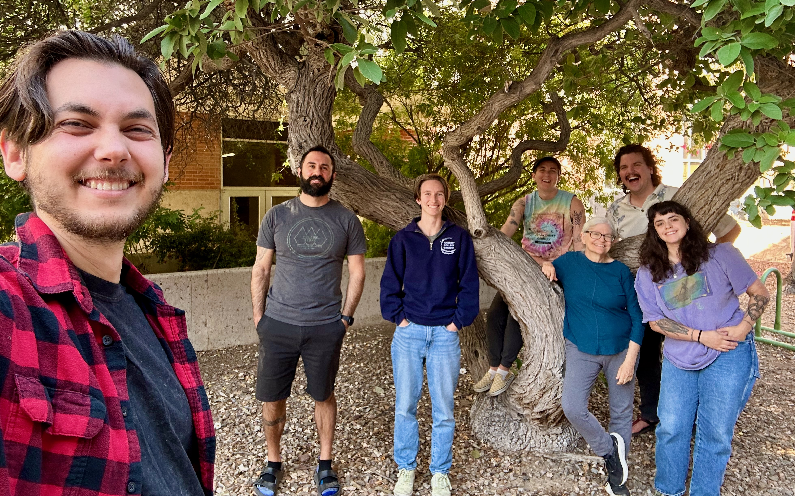

# I am a second year PhD student in the [Department of Ecology and Evolutionary Biology](https://eeb.arizona.edu) at the University of Arizona, advised by [Dr. Judith L. Bronstein](https://en.wikipedia.org/wiki/Judith_Bronstein). 
 Bronstein Lab c. 2025. From left to right: lab alumnus Alex Karnish, PhD, lab alumnus Austin Cruz, PhD, Molly Gans, Sav Fuqua (behind tree), Judie Bronstein, PhD, Nick Dabagia, Meredith Willmott.
#### I am interested in the impacts of environmental change on plant-pollinator communities. So far, these have been communities in the Rocky Mountains of Southwestern Colorado, since the [Rocky Mountain Biological Laboratory (RMBL)](https://www.rmbl.org) has been my home away from home in the summers since 2023.
#### I am fundamentally a field ecologist, no doubt because of my childhood spent rambling through the remnant blackland prairies and limestone creeks of North Texas, but also the summer I spent taking courses and doing fieldwork at 'Bug Camp', the [University of Michigan Biological Station](https://lsa.umich.edu/umbs) in Northern Michigan.
## Professional Background
#### I studied ecology and evolutionary biology at the University of Michigan, graduating with an honors BS with distinction and a minor in Buddhist studies. My undergraduate research at UM was with Elizabeth Tibbetts, where I worked on various projects in the lab related to the ecology and cognition of paper wasps. This research culminated in my senior honors thesis "Nest site selection and social group formation in _Polistes_ paper wasps", which received an Honors commendation from my thesis committee.

#### I also undertook research further afield while in my undergrad at the aforementioned RMBL, first as an NSF REU student, then as a research tech, and finally now as a PhD student. At the RMBL, I developed an REU research project to assess the impacts of various floral nectar microbes on pollinator behavior, and worked on other projects assessing the fitness impacts of nectar microbes on the plants that they inhabit. I have further served as a research team lead on the NSF-funded bee/flower phenology LongTerm Ecological Research (LTER) project led by PI [Dr. Becky Irwin (NCSU)](https://cals.ncsu.edu/applied-ecology/people/reirwin/). Becky remains a close associate and serves on my PhD committee.
## Research
#### My graduate research is funded by an NSF NRT fellowship through the [CAMBIUM program](https://cambium.arizona.edu) at the University of Arizona, as well as the [Jean H. Langenheim](https://en.wikipedia.org/wiki/Jean_Langenheim) graduate research fellowship at the RMBL.
## Papers
#### [Nectar yeast scent additions fail to impact overall bouquet and bumble bee visitation in a montane herb](https://www.journals.uchicago.edu/doi/pdf/10.1086/740774) (IJPS, in press).
#### with Valerie Martin, Daniel Souto-Vilaros, Robert Schaeffer, & Becky Irwin.
#### [Yeast volatiles promote larceny in bumble bee behavior](https://www.cell.com/iscience/fulltext/S2589-0042(26)00321-4) (iScience, 2026).
#### with Valerie Martin, Daniel Souto-Vilaros, Robert Schaeffer, Becky Irwin, et al.
## Contact Me
#### [lastname]@arizona[dot]edu
